# browser-fetch

A Claude Code skill that delegates browser automation to a lightweight subagent, reducing context consumption by 90%+.

## Problem

[agent-browser](https://github.com/vercel-labs/agent-browser) snapshots can consume 10,000+ tokens on complex pages, quickly exhausting your context window.

## Solution

This skill delegates browser operations to a Haiku subagent:

1. **Main agent** (Opus/Sonnet) sends high-level instructions
2. **Haiku subagent** executes agent-browser commands, saves raw data to files
3. **Haiku returns** only a structured summary (~100 tokens)
4. **Main agent** makes decisions based on summaries, not raw data

## Architecture

```mermaid
flowchart TB
    subgraph Files["scratchpad/browser-session/"]
        index["index.log"]
        f001["001.txt"]
        f002["002.txt"]
        more["..."]
    end

    subgraph Haiku["Haiku Subagent"]
        h1["agent-browser operations"]
        h2["snapshot → file"]
        h3["build summary"]
    end

    subgraph Main["Main Agent (Opus/Sonnet)"]
        m1["Define tasks"]
        m2["Review summaries"]
        m3["Issue next instructions"]
        m4["Read raw data (debug only)"]
    end

    Haiku -->|"save"| f001
    Haiku -->|"save"| f002
    Haiku -->|"append"| index
    Haiku -->|"summary only"| Main
    Main -->|"task instructions"| Haiku
    Main -.->|"debug only"| Files
```



## Sequence


## Prerequisites

```bash
npm install -g agent-browser
agent-browser install
```

## Installation

```bash
# Clone to your Claude Code skills directory
cd ~/.claude/skills
git clone https://github.com/ycookiey/browser-fetch.git
```

## Usage

Once installed, invoke with `/browser-fetch` or let Claude Code auto-detect when browser automation is needed.

See [SKILL.md](./SKILL.md) for detailed usage patterns.

## Key Features

- **90%+ context reduction**: Raw snapshots stay in files, only summaries reach main agent
- **Structured summaries**: Subagent returns page overview + key refs, not raw element lists
- **Debug-friendly**: Raw data saved to `scratchpad/browser-session/` for troubleshooting
- **Session persistence**: Browser state maintained across multiple operations

## License

MIT
